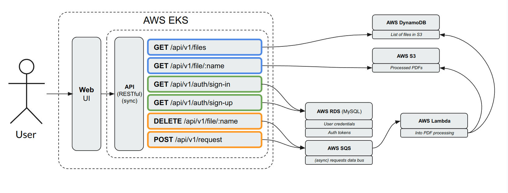
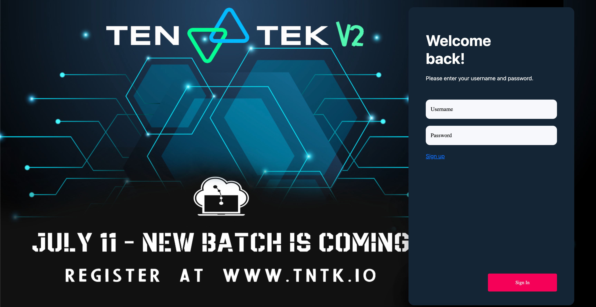
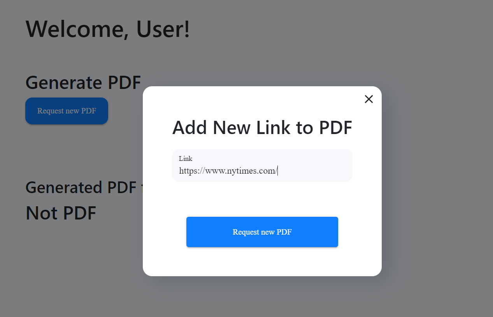
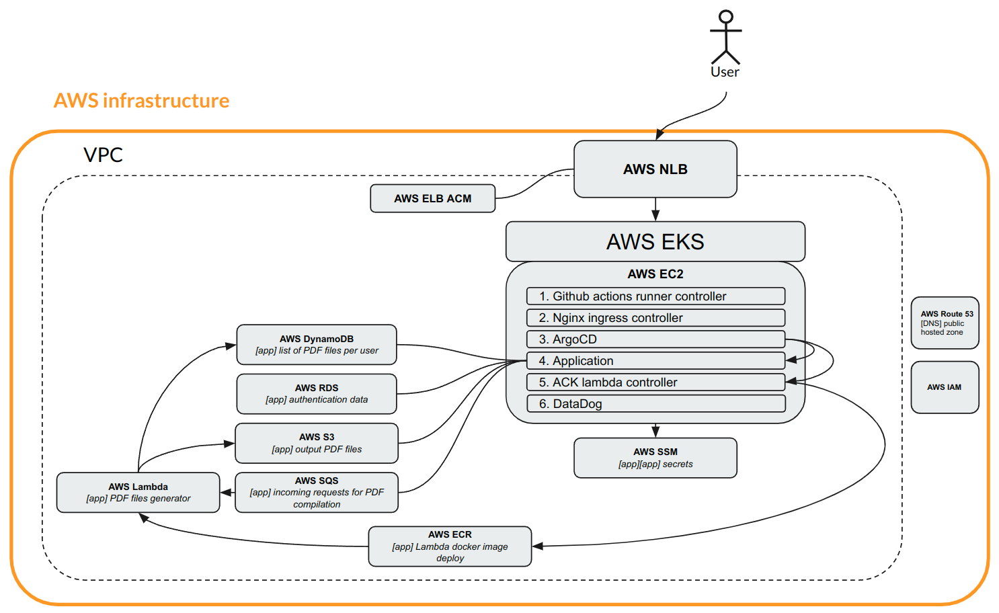
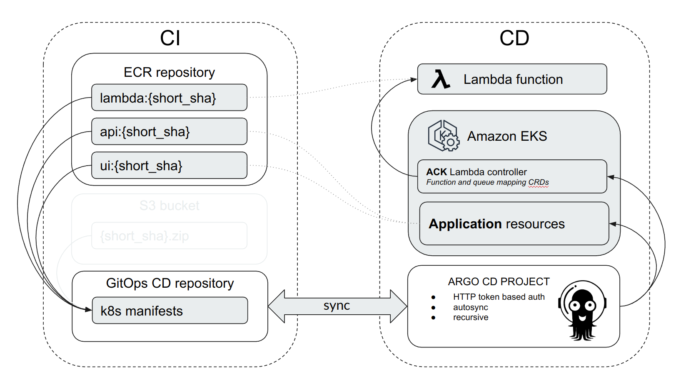
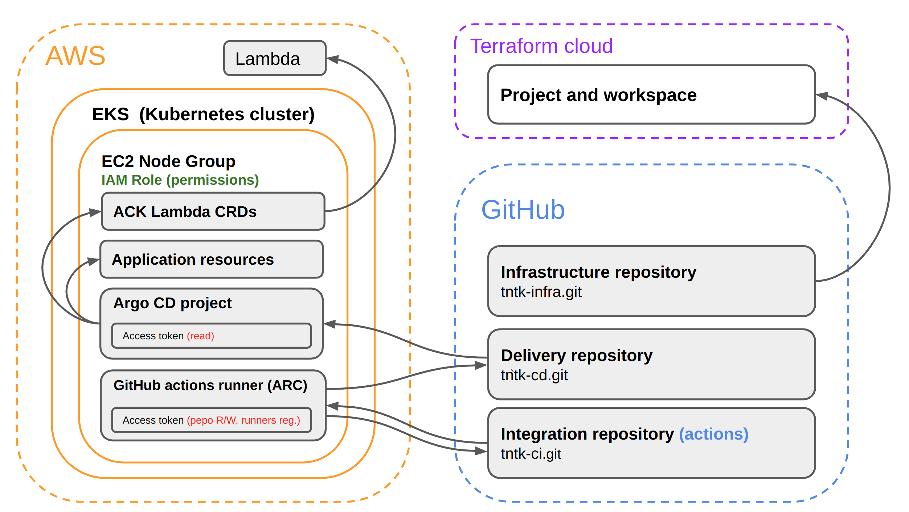

# Overview

This repository is an integral part of the learning project designed for training purposes. It contains the application code and its CI for integration into the infrastructure described in this repository:
https://github.com/tntk-io/tntk-infra

# Application definition and overview
This is a learning application that is designed for those who are learning DevOps. The application itself, like the entire project, is intended to cover a broader scope under the hood. The application's main task, consisting of frontend and backend, is to convert requested HTML pages to PDF and save these files with the possibility of having convenient authorized access to these objects through UI. It looks simple, but in the path of the whole operations cycle, we face several services from the world of AWS: RDS, SQS Lambda, DynamoDB, and S3.

## Architecture diagram

## Application layers
To visualize the entire app scope and understand what is in our application STACK, let’s look at it in layers and go through each. We have identified six primary layers, the application of which consists of the frontend, the backend, queues, serverless, databases, and object storage.

### Frontend
It is a single-page web application written in react JavaScript library. The frontend and backend are connected via the <b>REST API</b>.

The user interface allows you to perform the following actions with related HTTP methods:
<ul>
<li>Authorization

POST: /api/v1/sing-up

POST: /api/v1/sing-in</li>

<li>Execution of PDF conversion request

POST: /api/v1/request</li>

<li>Removing files from the list.

DELETE: /api/v1/file:name</li>

<li>List of available files to download

GET: /api/v1/files</li>

<li>Download specific file

GET: /api/v1/file/:name</li>
</ul>

After authentication, the user will have the option to make a request. After the user presses the corresponding button, a window appears where you can specify the URL to any page on the Internet.

Let’s look in more detail. When the backend receives a request from the frontend, it will pass the specified URL to the handler, which will render the HTML page and then convert it to a pdf file and save it to the object storage (S3). Then this file will appear in the list of available files for download. The generated file can be downloaded by clicking on the corresponding file name in the list. All files will only be available to users with appropriate access rights.

### Backend
Backend provides authentication and initial processing of incoming requests from users through API. It communicates directly with databases (PostgreSQL, Dynamo DB) and storage service S3. It also passes requested URLs from users to Lambda through the SQS service.

Backend part of the application Is written in Golang using 3rt party libraries; the main ones are:
<ul>
<li>Gin Web Framework. Provides the implementation of RESTful API 
<a href="https://github.com/gin-gonic/gin">https://github.com/gin-gonic/gin</a>

<li>GROM. ORM library for Golang. Provides CRUD operations with databases using known associations and object-relational models 
<a href="https://github.com/go-gorm/gorm/">https://github.com/go-gorm/gorm/</a>

<li>AWS SDK with a set of all utilities for programmatically accessing AWS services 
<a href="https://github.com/aws/aws-sdk-go-v2">https://github.com/aws/aws-sdk-go-v2</a>

<li>AWS Lambda for Go. Toolset for development of AWS Lambda functions in Golang 
<a href="https://github.com/aws/aws-lambda-go">https://github.com/aws/aws-lambda-go</a></li>

<li>wkhtmltopdf command line wrapper. HTML to PDF renderer 
<a href="https://github.com/SebastiaanKlippert/go-wkhtmltopdf">https://github.com/SebastiaanKlippert/go-wkhtmltopdf</a>
</ul>

There are also other auxiliary libraries in the application. The full list of them you can be found in the [go.mod](src/api/go.mod) file.

### Serverless
AWS Lambda is serverless and event-driven compute service that lets you run code for any application or backend service without provisioning or managing servers. Here we can release the workload of the virtual machine and optimize it.

The primary application workload (converting and file storing) is passed to the serverless technology AWS Lambda.  It performs several operations:

1. Direct rendering of user-requested HTML page
2. Convert HTML to PDF
3. Save the PDF file into AWS S3
4. Sending file information to NoSQL database AWS DynamoDB.
5. Deleting objects from S3 and records from DynamoDB.

The source code of the Lambda function is stored [here](src/api/lambda/main.go).

### Databases
We have been using two types of databases <b>relational</b> and <b>NoSQL</b>.

<b>MySQL</b> relational database stores the user credentials, which is hosted on the <b>AWS RDS</b> platform. The backend communicates with MySQL directly without a message queue.
Accordingly, two types of information are stored there:

1. User credentials (Users themselves and their passwords as MD5 hashes)

2. Authorization tokens (simple JWT)

Whenever a user is authorized, a temporary token is created. Accordingly, if the same user is authorized on two different devices, only the last authorized user will work. Previous tokens become invalid.

<b>DynamoDB</b> NoSQL database stores the key value data structure. The key is the user ID, and the value is the list of pdf files ready for download.

This means that when the API asks for all files available for download files, the backend retrieves the list from DynamoDB and returns it to the user. As a result, the user sees a list of files available for download. When we try to download a specific file, the backend receives a corresponding request on the API then goes to S3, downloads that file, and gives it to the user.

All HTTP GET methods described above communicate with DynamoDB directly opposite to the request POST method when the Lambda function appears in the middle of the file creation process.

### Objects storage

Amazon Simple Storage Service (Amazon S3) is an object storage service that is the best and most suitable for storing our files. Every time we generate a PDF it’s stored in the S3 Bucket. Information about the available files in the S3 bucket is obtained from DynamoDB for a specific authorized user.

### Application cloud placement diagram

The application lives in the EKS cluster, which is deployed in VPS with a network load balancer. The network load balancer shifts traffic to our worker node pools. Load balancer terminates SSL connections. Accordingly, it needs a certificate that is stored in AWS certificate manager.

### EKS node group
The Node group consists of a minimum of 2 workers. There are 6 main components:
Operational components:
<ul>
<li><b>Ingress Nginx Controller</b>: It is a Kubernetes controller that manages the Ingress resources and acts as a reverse proxy to route incoming HTTP and HTTPS traffic to the appropriate services within a cluster. It enables external access to applications running in the cluster.
</li>
<li><b>ArgoCD</b>: It is a declarative continuous delivery tool for Kubernetes. It automates the deployment of applications and provides a GitOps approach, allowing users to define the desired state of applications using Git repositories. ArgoCD ensures that the deployed applications match the desired state defined in the repository.
</li>
<li><b>GitHub Actions Runner Controller</b>: It is a component that manages and coordinates the execution of GitHub Actions workflows. GitHub Actions runners are the compute resources responsible for executing the steps defined in workflows. The runner controller helps manage and scale the runner instances based on the workload.
</li>
<li><b>ACK Lambda Controller</b>: ACK stands for "AWS Controllers for Kubernetes," and the ACK Lambda Controller is a specific implementation within ACK. It is responsible for managing the interaction between Kubernetes clusters and AWS Lambda functions. It allows you to deploy and manage Lambda functions using Kubernetes native resources and tools. This component was specifically chosen to adhere to the GitOps approach of deploying applications.
</li>
<li><b>Datadog</b> is a comprehensive monitoring and analytics platform that provides real-time visibility into the performance and health of your infrastructure, applications, and services. It offers a wide range of features including metrics monitoring, log management, application performance monitoring (APM), and more. With Datadog, you can easily collect, analyze, and visualize data from various sources, enabling you to optimize performance, troubleshoot issues, and make data-driven decisions for your organization.
</li>
</ul>
Application component:
<ul>

<li>Hosts the <b>application itself</b>. There's a backend, a frontend, and a horizontal autoscaler pod.</li>
</ul>

# CICD
In this project, we will be following the GitOps methodology, which involves having a separate repository (Git Ops repo) to store the state (manifests) of our application.
To achieve this, we will divide our CI/CD into two sections:

## Continuous integration (CI)
We are going to build the integration process on the GitHub platform, specifically using GitHub Actions.

To achieve these stages in the workflow, we need to create a YAML file with the following scenarion structure:

1. Compile source code

2. Build Docker images and push to the registry

3. Save manifests to GitOps repository

This workflow represents a file with a script that describes all the necessary actions for integration.
The result of executing this scenario is the creation of ready-to-use images for the application's microservices and prepared Kubernetes manifests. These manifests declaratively describe the application and its deployment in Kubernetes. All these manifests are saved in the GitOps repository.

## Continuous delivery (CD)
At this stage, the delivery of our code occurs strictly in accordance with the previously declared manifests. These manifests are saved in the GitOps repository. In other words, we need a mechanism or operator that will monitor the state of the code. As soon as new code is detected in the repository, it will trigger the application update and delivery of the new version.

Argo CD is a GitOps operator that automates the deployment and delivery of applications. It continuously monitors the GitOps repository for changes and ensures that the deployed applications align with the desired state defined in the manifests. Argo CD facilitates the declarative management of the application lifecycle within a Kubernetes cluster.

During the initial setup, you will install and configure Argo CD in your Kubernetes cluster. It will be connected to the GitOps repository where the manifests are stored, and you will define the desired state of your application through these manifests. Argo CD will then monitor the repository, detect changes, and orchestrate updates and deployments accordingly.

Argo CD allows to accomplish the following things:

<ul>
   <li> Pull-based synchronization: The operator continuously pulls the desired state from the Git repository and applies it to the system, rather than relying on push-based deployment mechanisms. </li>
   <li> configuration: The desired state of the system is defined declaratively in the Git repository, enabling version control, collaboration, and auditability. </li>
   <li> Reconciliation loop: The operator periodically reconciles the system's state with the desired state. If there are any differences, it takes appropriate actions to bring the system back to the desired state. </li>
</ul>

In simple terms, Argo CD will scan the state of our GitOps repository and automatically update the application if any changes are detected. For example, it can update the version of the images used in the application.
### CICD scheme 

It is important to note that we have a component called a Lambda function that exists outside the EKS cluster. Kubernetes does not have built-in tools for managing such resources. We could use an integration approach to update the Lambda function code but Lambda deployment require a separate deployment pipeline. This approach would contradict the GitOps practice and We need to fully delegate the management of the application's state to Kubernetes. To achieve this, we will use AWS Controllers for Kubernetes (ACK), specifically ACK Lambda. This controller allows us to manage Lambda functions based on Kubernetes manifests. Therefore, we can declaratively define manifests for the Lambda function and store them in a GitOps repository, which aligns with the GitOps practice.

Additional info about ACK Lambda:

https://aws.amazon.com/blogs/compute/deploying-aws-lambda-functions-using-aws-controllers-for-kubernetes-ack/

## Interaction of the components

The diagram of the main components involved in the CI/CD process and their integration (Permissions and access tokens) with each other:

1. <b>AWS EKS</b> 
Elastic Kubernetes Service is a managed service provided by Amazon Web Services for running Kubernetes clusters. In an EKS cluster, all application components and operational components are hosted. To grant access to these components to AWS services, you can simply assign an IAM Role to the EC2 Node Group. This ensures that everything running on these instances has access to AWS services.

2. <b>GitHab actions runner</b> 
The GitHub Actions agent installed in our cluster using ARC (actions-runner-controller) is integrated into the system using an GitHub Access token for the Integration repository.

3. <b>ArgoCD</b> 
The GitOps operator is responsible for delivering our application directly to EKS. It utilizes the GitHub Access token to read the manifests from the Delivery repository and EC2 Node Group IAM Role for deploy to EKS.

4. <b>ACK Lambda</b> 
Deploys lambda function from EKS to Lambda servcie using the same EC2 Node Group IAM Role

5. <b>GitHub repositories</b> 
Repositories themselves for CI/CD.

# Application deployment

After deploying infrastructure from https://github.com/tntk-io/tntk-infra repository we moving to application section. In this section we will deploy our application to our infastructure.

> Make sure that you have created the <b>CD repository</b> (in our case tntk-io/tntk-cd) before stat CI. This repository should not be public since it performs operational load and contains manifests with information that should not be distributed. It is necessary to create two branches in this repository: dev and prod.

1. Add Github secret to Repository Settings → Secrets and variables → Actions → Secrets ("API_TOKEN_GITHUB" with Github token as value).
2. Add Github variables to Repository Settings → Secrets and variables → Actions → Variables ("ACCOUNT_ID", "APPLICATION_NAME", "APPLICATION_NAMESPACE", "AWS_REGION", "BASE_DOMAIN", "CD_DESTINATION_OWNER", "CD_PROJECT").
3. Trigger CI pipeline. Our integration process depends on commit SHA and the easiest way to start new build is make a empty commit to the CI branch.
   Trigger CI pipeline by pushing new commit to project src repo:
   git commit --allow-empty -m "test emplty commit"
4. Wait for the CI process to finish.
5. Get argocd default admin password. We can get it inside AWS "EKS" service → EKS-cluster → Resources → Config and secrets → Secrets → "argocd-initial-admin-secret" → password "decode".
6. Login to argo CD and check sync of "demo" application. (e.g. "https://argo.prod.example.com/").
7. Check the application (e.g. "https://demoapp.prod.example.com/").
8. Create new user and login.